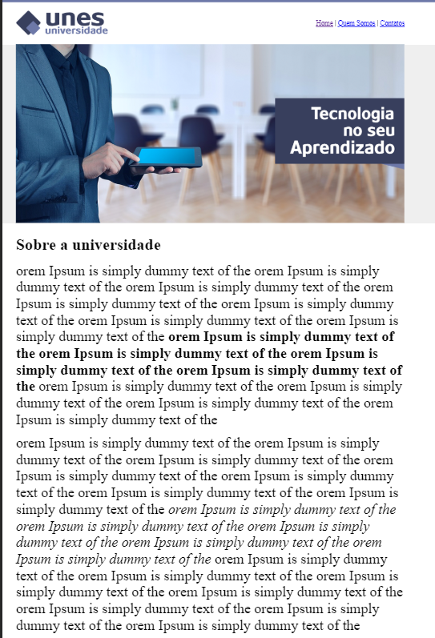
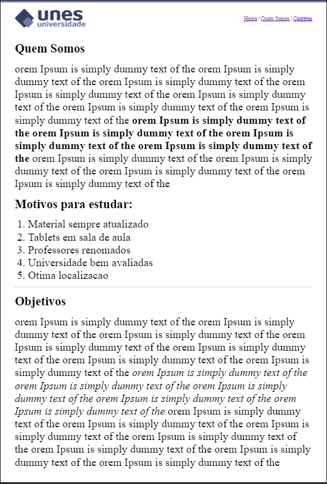
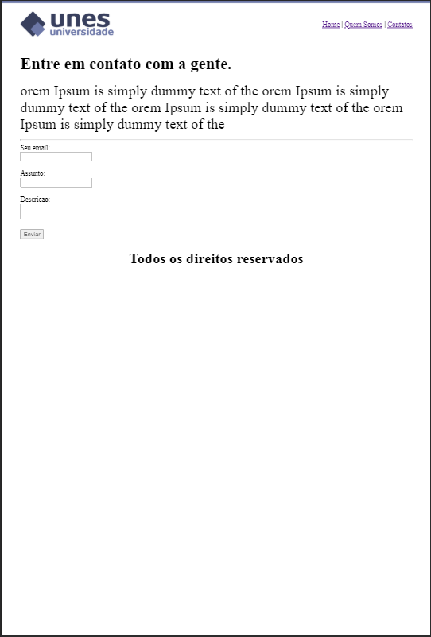
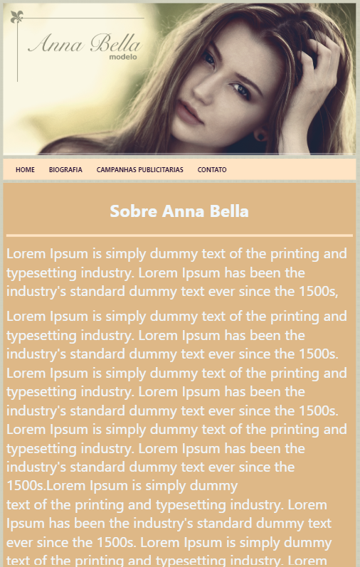
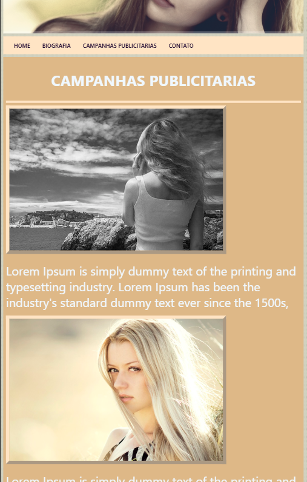

<h2 align="center">
  Desenvolvimento Web :computer:
</h2>

---

  

  

  

  <a href="#octocat-sobre-o-repositorio">Sobre esse repositorio </a> &nbsp;&nbsp;&nbsp;|&nbsp;&nbsp;&nbsp;<a href="#milky_way-projetos">Projetos </a> &nbsp;&nbsp;|&nbsp;&nbsp;
  <a href="#memo-licença">Licença</a>&nbsp;&nbsp; 

---

## :octocat: Sobre o repositorio
  Repositori destinado ao aprendizado das principais tecnologias do desenvolvimento web.

  Criar aplicações web profissionais e completas, do front-end ao back-end, utilizando tecnologias como HTML5, CSS3, BootStrap 4, JavaScript, ES6, PHP 7, OO, MySQL, DAO, PDO, AJAX, JQuery, MVC, API, IONIC e Wordpress.

  Integrar as principais tecnologias Web através de projetos reais!
  Criar aplicações Mobile conectadas a aplicações WEB utilizando a tecnologia IONIC.

## :milky_way: Projetos
- ## 1. HTML / CSS
   - <a href="#Unes">Unes</a>
   - <a href="#Anna-Bella">Anna Bella</a>
---

- ### Unes
  Site para uma universidade ficticia chamada Unes. O site com três paginas: principal, sobre e contatos.
  A Pagina inical fala um pouco sobre a universidade, ela tem como objetivo demostrar o uso de estilos de formatação de texto, como negrito e itlaico, uso de tegs de marcação de texto e links. A Pagina Quem somos é utilizada para a demostração do uso de listas, e por fim a pagina Contato é aqui utilizada para demostar as tegs de input e o uso de botons.

  

    

    

    

  
 
---
- ### Anna Bella
  Projeto destinado a demostrar o uso basico de tags HTML com folhas de estilos (CSS). Foram usados conseitos basico de CCS como alinhamento e formatação de texto, background, bordas em images e estilização de menu.
  

---

## :memo: Licença

Esse projeto está sob a licença MIT.